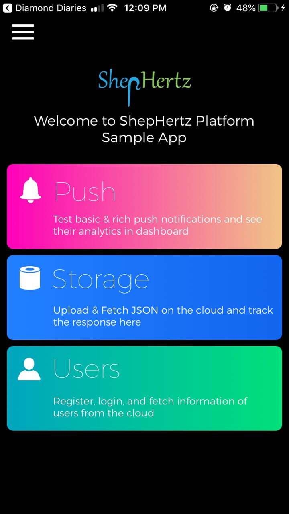
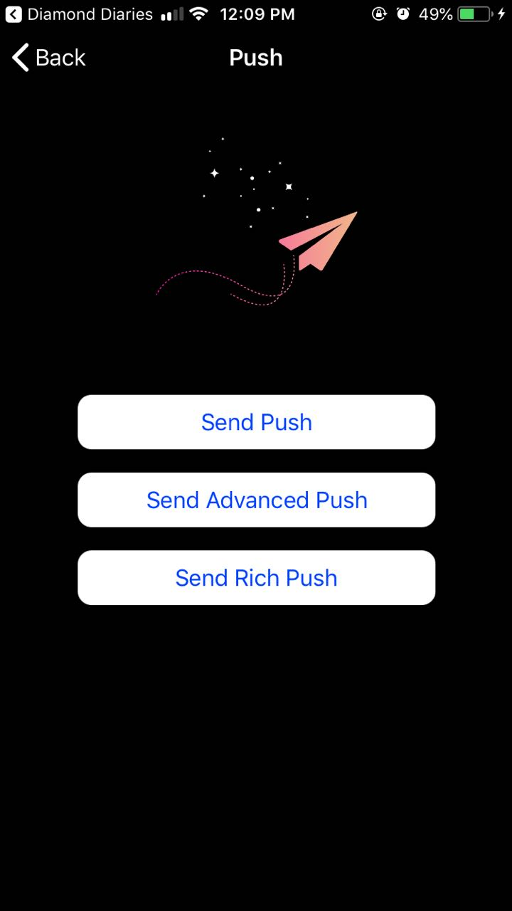
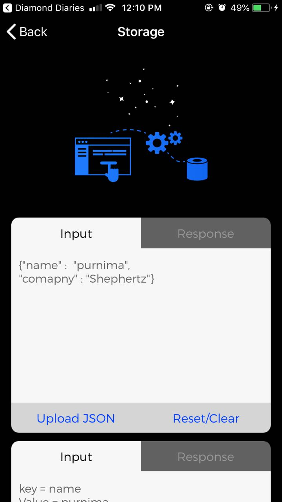
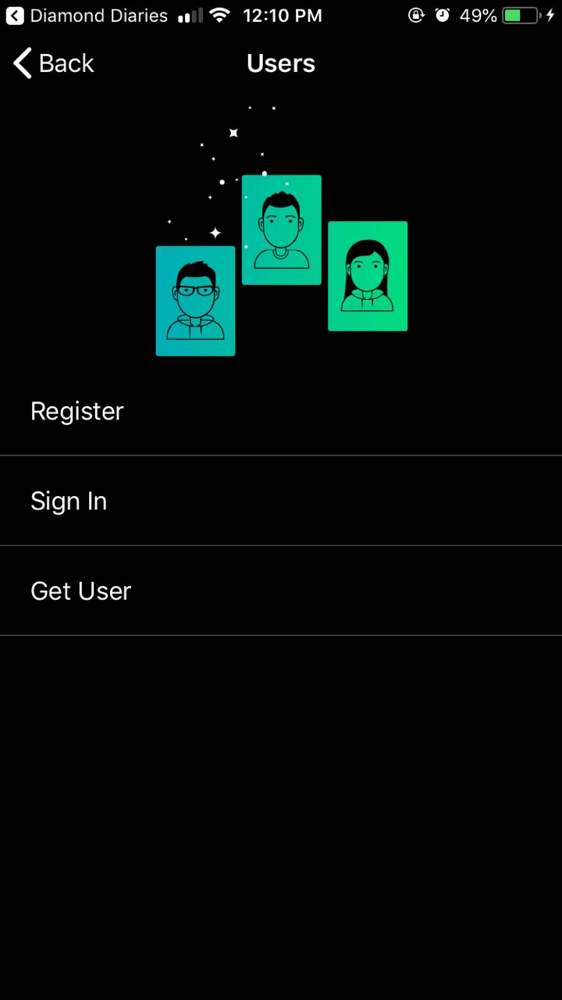
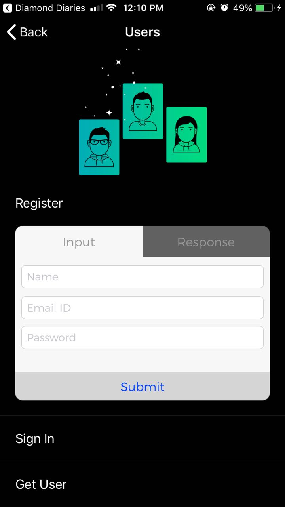
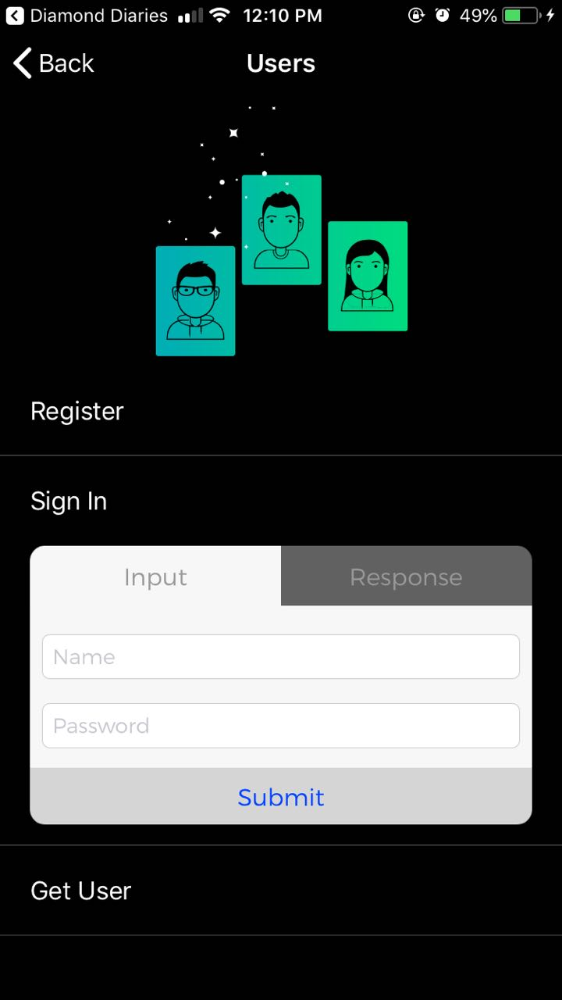
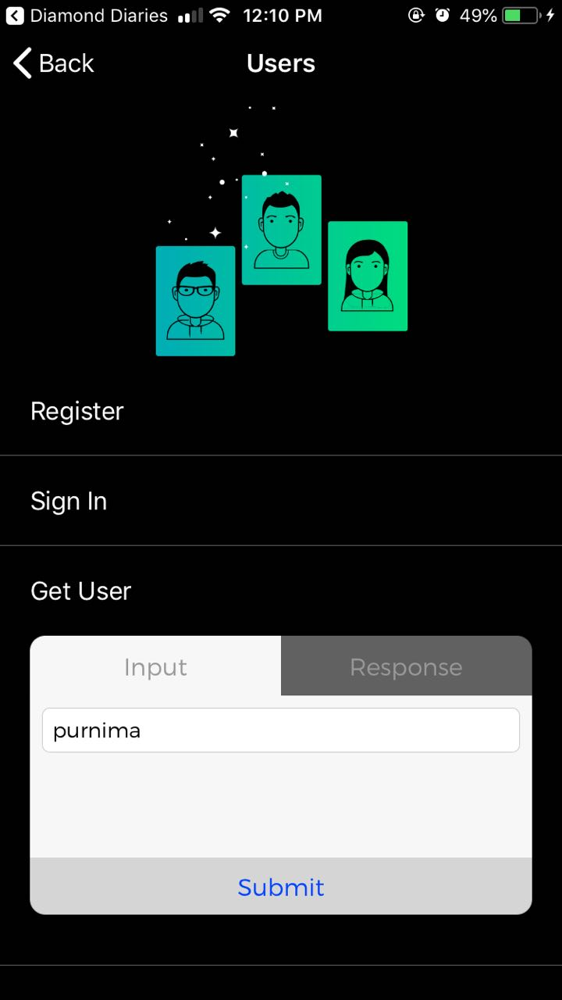
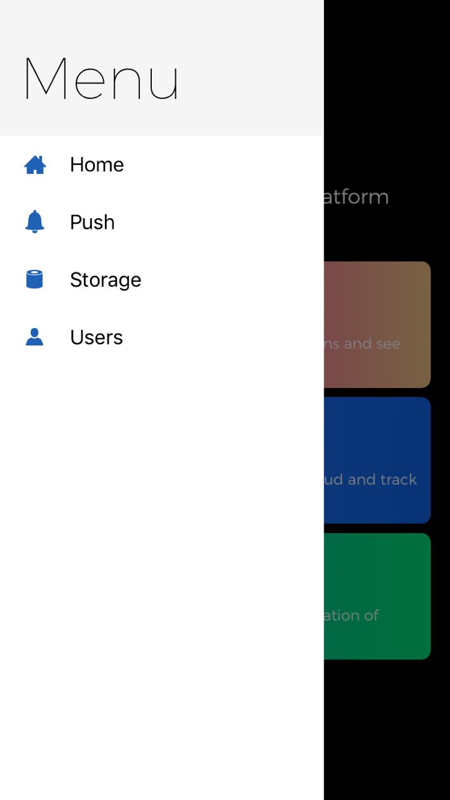

# App42Service

App42 Service App

### Features in this app:
- App42 provides Push Notifications through the App42 Cloud APIs as well as through App42 Marketing Automation (Campaign & Segmentation based)
  + Send push message to a particular user.
  + Send push message containing JSON or in key value format to the user. On receiving this message on device, it has to be parsed and accessed accordingly.
  + Send Rich Push notification with media (iOS 10+)
  
- Storage service provides an efficient way to manage JSON documents in NoSQL database on the cloud. You can store, update, search a JSON document and can also apply mapReduce search for storing documents. For example, if you try to store a JSON document “{"Company":"Shephertz"}”, it will be stored with unique Object ID in the format: {“Company”:”Shephertz”,”_id”:{“$oid”:”4f423dcce1603b3f0bd560cf”}}. This ID can be used later to access/search the document.
  + Save the JSON document in giving database name and collection name.
  + Find target documents using custom query in documents stored in the given database and collection by using key value search parameter
  
- Almost every app requires User Management, at the simplest level Registration and Authentication. The App42 APIs provides a comprehensive User Management solution to handle users both as App42 Users and Social Users. The service contains operations for managing user creation, authentication, state (revoking, locking, expiry etc.), role management, profile management, password policy, etc.  
  + Create a User session for the specified User. 
  + Authenticate user based on username and password.
  + Get user details based on username.
  
  

